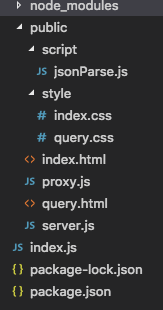
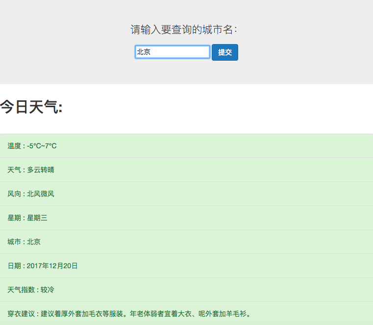

#项目简介：
基于node、express的天气查询小工具，通过设置代理转发聚合数据的api数据到本地服务器，解决跨域问题，并通过对返回的json数据解析，实现对天气的查询。

#用法：
该工具分为以下几个部分：

node_modules、package.json、index.js、public文件夹

node_modules用来放置依赖的模块

package.json 用于展示项目所依赖的npm包 

index.js node主文件

public 放置代理服务器proxy.js模块、路由模块server.js、index.html、query.html、css和script文件

首先在命令行中运行node index.js

浏览器输入127.0.0.1：3000/query

结果如下

	
